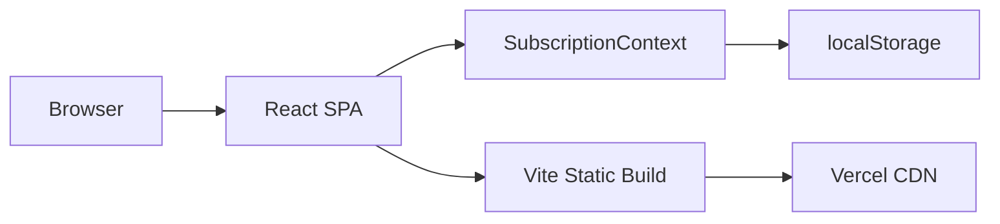
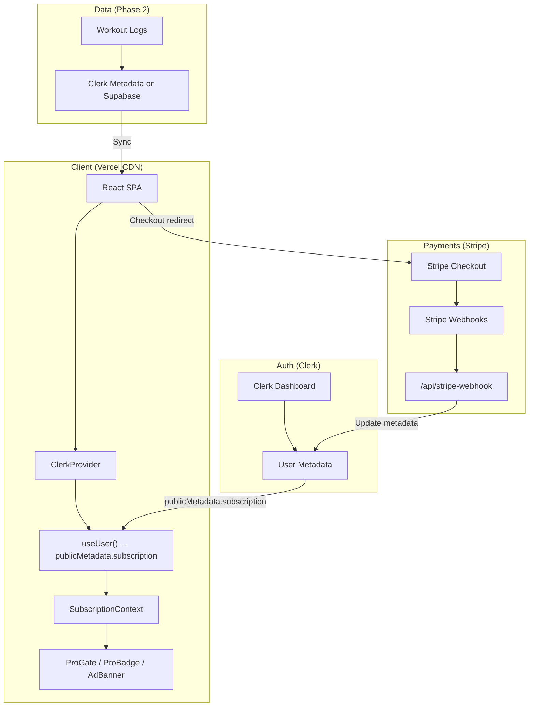

# BoxingWiki Pro — Architecture Assessment

## Current State: Client-Side Only



Everything runs in the browser. There is no backend, no database, no server-side auth. This is intentional for the prototype phase, but it creates clear production bottlenecks.

---

## Production Bottlenecks

### 1. 🔴 Client-Side Auth Bypass (Critical)

**Problem:** `isPro` is derived from `localStorage`. Any user can open DevTools, run `localStorage.setItem('bw_subscription', '{"tier":"pro"}')`, and unlock everything.

**Impact:** 100% paywall bypass. Zero revenue protection.

**Fix:** Subscription state must come from a server-side source of truth. Clerk user metadata (populated via Stripe webhooks) is the correct pattern:

```
Stripe webhook → Edge Function → Clerk.users.updateMetadata({ subscription: 'pro' })
                                       ↓
                          React reads from useUser().publicMetadata.subscription
```

---

### 2. 🔴 localStorage Data Loss (Critical)

**Problem:** All user data (workout logs, program progress, favorites, subscription state) lives in localStorage. Clearing browser data, switching browsers, or using incognito = total data loss.

**Impact:** Users lose workout history, program progress, and favorites without warning. Paying Pro users would lose their subscription state locally even though Stripe still charges them.

**Fix:** Migrate to a user-scoped database. Options:
- **Clerk user metadata** (simplest — JSON blob per user, good for <50KB)
- **Supabase/Neon Postgres** (if tracking data grows beyond metadata limits)
- **Firestore** (if you want real-time sync across devices)

---

### 3. 🟡 No Cross-Device Sync

**Problem:** A user who logs workouts on their phone at the gym has no way to see that data on their laptop at home.

**Impact:** Directly undermines the Pro value proposition ("Track your progress"). Users paying $3.99/month expect their data to exist everywhere.

**Fix:** Any of the database solutions above solve this. Clerk metadata is the lowest-friction option since you're already using Clerk for auth.

---

### 4. 🟡 Missing Webhook Pipeline

**Problem:** No server-side endpoint exists to receive Stripe events (`checkout.session.completed`, `customer.subscription.deleted`, `invoice.payment_failed`).

**Impact:** You can't:
- Activate Pro after payment
- Downgrade when subscription lapses
- Handle failed payments gracefully
- Issue refunds that auto-downgrade

**Fix:** Vercel Edge Functions or API Routes:
```
/api/stripe-webhook.js → verifies Stripe signature → updates Clerk user metadata
```

---

### 5. 🟢 Monolithic Bundle Growth

**Problem:** Currently at 240KB gzipped for `index.js`. As features grow (tracking charts, history tables, preset editors), this will balloon.

**Impact:** Slower initial load, especially on mobile. The lazy-loading is good but the core bundle still ships everything.

**Fix:** Already partially solved with `React.lazy()`. Future features should:
- Code-split the TrainingHistoryPage, PricingPage, and any chart libraries
- Consider dynamic imports for heavy dependencies (e.g., `recharts` for stats)
- Use Vercel's automatic code-splitting if migrating to Next.js

---

### 6. 🟢 No Rate Limiting or Abuse Prevention

**Problem:** No server = no rate limiting. The pricing page CTAs currently call `startTrial()` which just sets localStorage. In production, Stripe Checkout handles this, but the trial endpoint needs server-side validation.

**Impact:** Users could abuse free trials by creating multiple accounts.

**Fix:** Stripe handles trial enforcement natively via `trial_period_days` on the subscription. Clerk can store `trialUsed: true` in private metadata to prevent repeat trials across logins.

---

## Target Production Architecture



## Migration Path

| Phase | Scope | Effort |
|-------|-------|--------|
| **Now (done)** | localStorage prototype, all UI gates, pricing page | ✅ Complete |
| **Phase 3a** | Clerk auth (sign-in/up flows, provider wrap) | ~2 hours |
| **Phase 3b** | Stripe products + Checkout integration | ~3 hours |
| **Phase 3c** | Webhook endpoint + Clerk metadata sync | ~2 hours |
| **Phase 3d** | Migrate localStorage data to Clerk metadata | ~2 hours |
| **Phase 4** | Supabase for workout tracking (if data > 50KB/user) | ~4 hours |

> [!IMPORTANT]
> The current `SubscriptionContext` is designed as a clean abstraction layer. When Phase 3 lands, only the **internals** of this context change (from localStorage reads to Clerk metadata reads). Every component that uses `isPro`, `isWorkoutFree()`, `isProgramFree()` etc. remains untouched.

## What's Scalable Today

- ✅ Gate component architecture (ProGate, ProBadge) — reusable, decoupled
- ✅ SubscriptionContext abstraction — swappable backend
- ✅ Lazy-loaded routes — good code-splitting foundation
- ✅ CSS variables design system — consistent theming
- ✅ Free content strategy — free tier genuinely useful, not crippled

## What Breaks at Scale

- ❌ localStorage for user data (>1 device = broken)
- ❌ No server-side subscription validation (trivially bypassable)
- ❌ No webhook pipeline (can't sync payment events)
- ❌ Workout tracking without persistence (data loss on clear)
