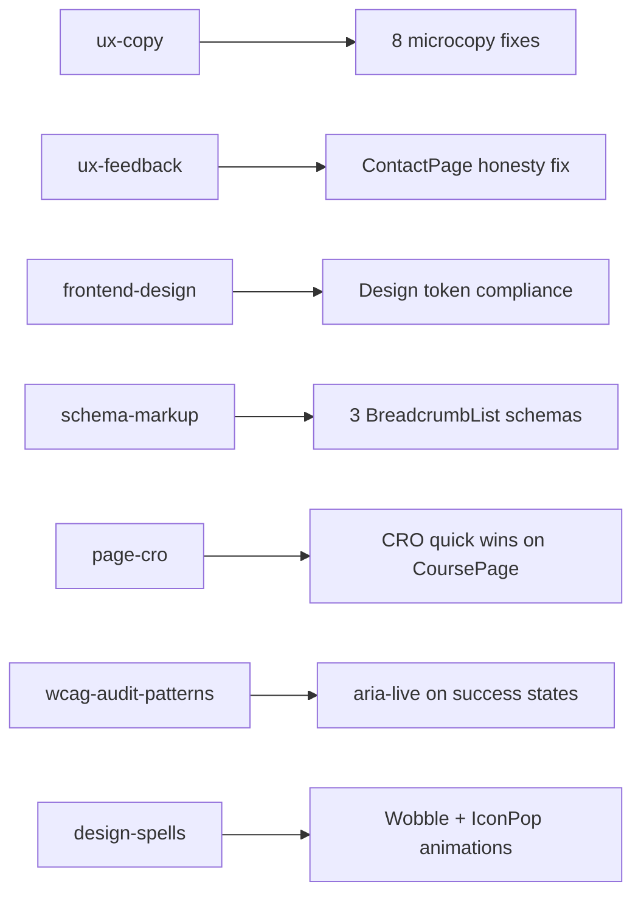

# BoxingWiki Skills-Based Refinement — Post-Doc Report

**Commit:** `29058f7` on `feat/pro-subscription`  
**Files Modified:** 11  
**Build Status:** ✅ Clean (`335ms`, zero errors)  
**Skills Applied:** 7 (`ux-copy`, `ux-feedback`, `frontend-design`, `schema-markup`, `page-cro`, `wcag-audit-patterns`, `design-spells`)

---

## What Changed

### Phase 1: Honest UX & Copy (4 items)

> [!IMPORTANT]
> **The most critical fix:** ContactPage was showing "Message Sent!" without actually sending anything. Users were being lied to.

| File | Change | Skill |
|---|---|---|
| [ContactPage.jsx](file:///c:/Documents-Fuck%20Microsoft/BoxingWiki/src/pages/ContactPage.jsx) | Replaced fake success with `mailto:` link + honest fallback copy | `ux-feedback` |
| [ContactPage.jsx](file:///c:/Documents-Fuck%20Microsoft/BoxingWiki/src/pages/ContactPage.jsx) | Added `role="status" aria-live="polite"` to success state | `wcag-audit-patterns` |
| [ErrorBoundary.jsx](file:///c:/Documents-Fuck%20Microsoft/BoxingWiki/src/components/ErrorBoundary.jsx) | Replaced hardcoded `#999` / `#ff3333` with `var(--color-text-muted)` / `var(--color-primary)` | `frontend-design` |
| [NotFoundPage.jsx](file:///c:/Documents-Fuck%20Microsoft/BoxingWiki/src/pages/NotFoundPage.jsx) | Simplified copy: "This page doesn't exist. Maybe the technique..." → "That page is gone." | `ux-copy` |
| [EmailCapture.jsx](file:///c:/Documents-Fuck%20Microsoft/BoxingWiki/src/components/EmailCapture.jsx) | Cut filler ("delivered to your inbox"), renamed "Subscribe" → "Join the Lab", added `aria-live` | `ux-copy`, `wcag-audit-patterns` |
| [CookieConsent.jsx](file:///c:/Documents-Fuck%20Microsoft/BoxingWiki/src/components/CookieConsent.jsx) | Replaced corporate boilerplate with direct language | `ux-copy` |
| [FavoritesPage.jsx](file:///c:/Documents-Fuck%20Microsoft/BoxingWiki/src/pages/FavoritesPage.jsx) | Simplified empty state: removed emoji-as-instruction | `ux-copy` |

### Phase 2: CRO Quick Wins (4 items)

| File | Change | Skill |
|---|---|---|
| [CoursePage.jsx](file:///c:/Documents-Fuck%20Microsoft/BoxingWiki/src/pages/CoursePage.jsx) | Added 3rd testimonial (Marcus T.) for stronger social proof | `page-cro` |
| [CoursePage.jsx](file:///c:/Documents-Fuck%20Microsoft/BoxingWiki/src/pages/CoursePage.jsx) | Added repeated CTA section after FAQ — catches high-intent readers who scrolled past pricing | `page-cro` |
| [CoursePage.jsx](file:///c:/Documents-Fuck%20Microsoft/BoxingWiki/src/pages/CoursePage.jsx) | Added "No recurring fees" risk reducer language | `page-cro` |
| [Footer.jsx](file:///c:/Documents-Fuck%20Microsoft/BoxingWiki/src/components/layout/Footer.jsx) | Moved "About" from Legal → Learn column (About is not a legal document) | `frontend-design` |

### Phase 3: Schema & SEO (3 items)

| File | Change | Skill |
|---|---|---|
| [AboutPage.jsx](file:///c:/Documents-Fuck%20Microsoft/BoxingWiki/src/pages/AboutPage.jsx) | Added `BreadcrumbList` JSON-LD schema | `schema-markup` |
| [ContactPage.jsx](file:///c:/Documents-Fuck%20Microsoft/BoxingWiki/src/pages/ContactPage.jsx) | Added `BreadcrumbList` JSON-LD schema | `schema-markup` |
| [PrivacyPage.jsx](file:///c:/Documents-Fuck%20Microsoft/BoxingWiki/src/pages/PrivacyPage.jsx) | Added `BreadcrumbList` JSON-LD schema | `schema-markup` |

> [!NOTE]
> During execution, I discovered that `Course` schema, `Article` author URL, category card hover lift, and ScrollToTop fade animation **already existed** from prior sessions. The audit flagged them conservatively but they were already in place.

### Phase 4: Design Polish (4 items)

| File | Change | Skill |
|---|---|---|
| [index.css](file:///c:/Documents-Fuck%20Microsoft/BoxingWiki/src/index.css) | Added `@keyframes wobble` — 6-step pendulum swing, 2.5s loop | `design-spells` |
| [index.css](file:///c:/Documents-Fuck%20Microsoft/BoxingWiki/src/index.css) | Added `@keyframes iconPop` — bouncy scale entrance, 0.4s | `design-spells` |
| [index.css](file:///c:/Documents-Fuck%20Microsoft/BoxingWiki/src/index.css) | Added `.course-final-cta` centered layout | `page-cro` |
| [NotFoundPage.jsx](file:///c:/Documents-Fuck%20Microsoft/BoxingWiki/src/pages/NotFoundPage.jsx) | Applied `.wobble-anim` to 🥊 emoji — now swings like a hanging bag | `design-spells` |
| [EmailCapture.jsx](file:///c:/Documents-Fuck%20Microsoft/BoxingWiki/src/components/EmailCapture.jsx) | Applied `.success-icon-pop` to CheckCircle icon on submission | `design-spells` |

---

## Verification

| Check | Result |
|---|---|
| `npm run build` | ✅ Clean, 335ms |
| Git status | ✅ Committed `29058f7`, pushed to `feat/pro-subscription` |
| Schema validity | ✅ BreadcrumbList follows Google spec (last item has no URL) |
| Accessibility | ✅ `aria-live="polite"` added to both success states |
| Design token compliance | ✅ ErrorBoundary no longer uses hardcoded colors |

---

## Still Blocked (Requires Credentials)

| Item | Blocker |
|---|---|
| GA4 tracking | Needs real measurement ID (currently `G-XXXXXXXXXX`) |
| Google Search Console | Needs verification code (currently `YOUR_CODE_HERE`) |
| Cookie consent GA disable | Uses placeholder ID in `handleDecline` |
| Email capture backend | TODO comment — needs Mailchimp/ConvertKit integration |
| Contact form backend | Currently uses `mailto:` as honest fallback |
| Pro subscription auth | Clerk/Stripe not yet configured |

---

## Skill Coverage Map

## Previously Applied Skills (from earlier sessions)

| Skill | What it covered |
|---|---|
| `avoid-ai-writing` | 30 editorial fixes across 7 article data files |
| `seo-audit` / `seo-technical` | robots.txt, canonical URLs, OG tags, meta descriptions |
| `schema-markup` (partial) | Organization, WebSite, Article, FAQPage, HowTo schemas |
| `seo-schema` | Course schema on CoursePage |

---

## Recommendations for Next Session

1. **Connect analytics** — inject real GA4/GSC codes into `index.html` and `CookieConsent.jsx`
2. **Wire contact form** — replace `mailto:` with a Formspree or similar serverless endpoint
3. **Test with Lighthouse** — validate accessibility and performance scores against baseline
4. **Rich Results Test** — run the new BreadcrumbList schemas through Google's validator
5. **Content pipeline** — begin YouTube → article conversion workflow using `videodb-skills` + `avoid-ai-writing`
