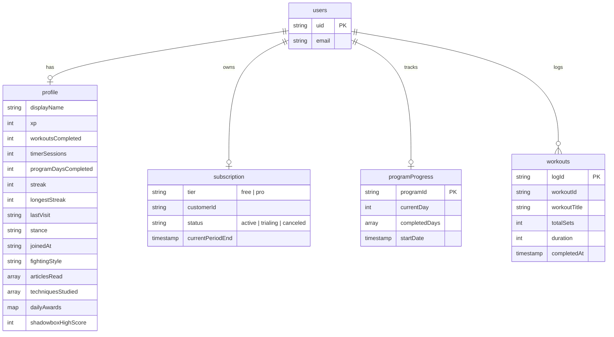

# Master Reference & Firebase Database Migration Guide

This reference outlines all major features implemented in the BoxingWiki application, details the current client-side `localStorage` data schema, and provides a direct map for migrating this data to Firebase (Firestore, Auth, or Realtime Database).

---

## 1. Feature Implementations (Master Reference)

### 🥊 Shadowbox Tracker & Gamification (`ShadowboxTracker.tsx`)
- **Visuals**: A sleek, camera-based canvas processing interface tailored for boxing workouts. Displays a real-time motion energy bar graph and flashes colors (neon green/red) on hit success.
- **Controls**: Speed adjustments, sensitivity threshold calibration slider, stance mirror toggle, and audio sound/beep toggle.
- **Mechanics**: Detects frame-by-frame pixel changes in real time. Generates oscillator-based audio beeps to signal jab, cross, hooks, and slip timings.
- **High Scores**: Saves and updates local personal records (`bw_tracker_high_score`).

### 🧬 Stance Synchronization (`StanceContext.tsx`)
- **Mechanics**: Persists a global `orthodox` or `southpaw` stance selection.
- **Translation**: Dynamic content rendering in techniques and workouts (e.g. automatically translates "Lead Hand" to "Left Jab" for Orthodox and "Right Jab" for Southpaw).

### 🏆 Fighter Profile & XP Engine (`FighterProfileContext.tsx` / `fighterProfile.ts`)
- **Gamification**: Accumulates Experience Points (XP) for actions: completing workouts, studying techniques, reading articles, running timers, or earning daily login streak bonuses.
- **Rank Tiers**: Prospect (0 XP), Contender (100 XP), Gatekeeper (500 XP), Rising Star (1000 XP), Champion (2500 XP), and Hall of Famer (5000 XP).
- **Style Detection**: Detects user's active fighting style based on their metrics (e.g., "Conditioning Machine", "Student of the Game", "Pressure Fighter").

### 🚦 A/B Test Routing (`abTest.ts`)
- **Mechanics**: Splits users 50/50 into group A or B for pricing page tests. Tracks allocation events and persists group assignments.

### 🛡️ Safety & Disclaimer Overlays
- **Safeguards**: Implemented sticky legal and health disclaimers at the base of dynamic heavy bag and shadowboxing workouts, warning users of physical exertion limits and recommending wraps/gloves.

---

## 2. LocalStorage Data Schema Map

The following client-side storage keys exist in the current application. Switch to Firebase to ensure data persistence across devices, prevent account spoofing (DevTools subscription bypasses), and secure user profiles.

| LocalStorage Key | Type | Description / Schema | Security Sensitivity |
| :--- | :--- | :--- | :--- |
| `boxingwiki_fighter_profile` | `Object` (JSON) | `{ displayName: string, xp: number, workoutsCompleted: number, articlesRead: string[], techniquesStudied: string[], timerSessions: number, programDaysCompleted: number, longestStreak: number, joinedAt: string, dailyAwards: Record<string, string> }` | Medium |
| `boxingwiki_programs` | `Object` (JSON) | `{ [programId: string]: { currentDay: number, completedDays: number[], startDate: string } }` | Low |
| `boxingwiki_workout_log` | `Array` (JSON) | `Array<{ id: string, workoutId: string, workoutTitle: string, exercisesCompleted: number, totalSets: number, duration: number, completedAt: string }>` | Low |
| `boxingwiki_streak` | `Number` | Current consecutive active training days. | Low |
| `boxingwiki_last_visit` | `String` | Last visit date: `YYYY-MM-DD`. | Low |
| `bw_subscription` | `Object` (JSON) | `{ tier: 'free' \| 'pro', expiry?: string, stripeId?: string }` | **High** (Trivially bypassed via browser console) |
| `boxingwiki_stance` | `String` | `'orthodox' \| 'southpaw'` | Low |
| `bw_tracker_high_score` | `Number` | Highest punches-per-minute count recorded in shadowboxing. | Low |
| `bw_daily_reminders` | `Boolean` | User setting enabling daily notifications. | Low |
| `bw_reminder_hour` | `String` | Scheduled time for daily notifications: `HH:MM`. | Low |
| `bw_last_reminder_date` | `String` | Date of last dispatched local reminder: `YYYY-MM-DD`. | Low |
| `bw_cookie_consent` | `String` | `'accepted' \| 'declined'` | Low |
| `bw_ab_test_[testKey]` | `String` | `'A' \| 'B'` (Assigned variant) | Low |

---

## 3. Firebase Migration Implementation Blueprint

When you initialize Firebase, structure your Firestore collections to match the logged-in user's UID (`auth.uid`).

### A. Recommended Firestore Collection Structure



---

## 4. Firestore Path Assignments

### User Profile Document
* **Path**: `/users/{uid}`
* **Schema**:
```json
{
  "displayName": "Fighter",
  "joinedAt": "2026-05-20T07:00:00Z",
  "stance": "orthodox",
  "stats": {
    "xp": 550,
    "streak": 3,
    "longestStreak": 14,
    "lastVisit": "2026-05-20",
    "workoutsCompleted": 12,
    "timerSessions": 5,
    "programDaysCompleted": 4,
    "shadowboxHighScore": 84
  },
  "progress": {
    "articlesRead": ["how-to-throw-a-jab", "slip-vs-roll"],
    "techniquesStudied": ["jab", "cross", "lead-hook"],
    "dailyAwards": {
      "workout_complete": "2026-05-20",
      "streak_7": "2026-05-18"
    }
  }
}
```

### Workout Log Collection
* **Path**: `/users/{uid}/workouts/{logId}`
* **Schema**:
```json
{
  "workoutId": "heavy-bag-power",
  "workoutTitle": "Heavy Bag Power & Volume",
  "totalSets": 6,
  "duration": 1800,
  "completedAt": "2026-05-20T07:56:00Z"
}
```

### Program Progress Collection
* **Path**: `/users/{uid}/programs/{programId}`
* **Schema**:
```json
{
  "currentDay": 3,
  "completedDays": [1, 2],
  "startDate": "2026-05-18T08:00:00Z"
}
```

---

## 5. Security Rules (Crucial for Firebase Deployment)

Ensure users can only write to their own profile data, and lock down the subscription collection so it is **read-only** to the client (to be modified only by server-side Firebase Cloud Functions reacting to Stripe Webhooks).

```javascript
rules_version = '2';
service cloud.firestore {
  match /databases/{database}/documents {
    
    // User Profile Rules
    match /users/{userId} {
      allow read, write: if request.auth != null && request.auth.uid == userId;
      
      // Sub-collections under the user
      match /workouts/{workoutId} {
        allow read, write: if request.auth != null && request.auth.uid == userId;
      }
      
      match /programs/{programId} {
        allow read, write: if request.auth != null && request.auth.uid == userId;
      }
    }
    
    // Subscription Rules (Locked to server/webhook updates)
    match /subscriptions/{subscriptionId} {
      allow read: if request.auth != null && request.auth.uid == resource.data.userId;
      allow write: if false; // Only cloud functions/admin SDK can modify this
    }
  }
}
```

---

## 6. Migration Code Draft

Once Firebase is initialized, run this check once upon user login to sync legacy local data:

```typescript
import { db, auth } from './firebase';
import { doc, setDoc, writeBatch } from 'firebase/firestore';

export async function migrateLocalToFirebase() {
  const user = auth.currentUser;
  if (!user) return;

  const userDocRef = doc(db, 'users', user.uid);
  
  // 1. Migrate Profile & Stats
  const localProfile = localStorage.getItem('boxingwiki_fighter_profile');
  const localStance = localStorage.getItem('boxingwiki_stance');
  const localHighScore = localStorage.getItem('bw_tracker_high_score');
  
  if (localProfile) {
    const profile = JSON.parse(localProfile);
    await setDoc(userDocRef, {
      displayName: profile.displayName || user.displayName || 'Fighter',
      joinedAt: profile.joinedAt || new Date().toISOString(),
      stance: localStance || 'orthodox',
      stats: {
        xp: profile.xp || 0,
        workoutsCompleted: profile.workoutsCompleted || 0,
        timerSessions: profile.timerSessions || 0,
        programDaysCompleted: profile.programDaysCompleted || 0,
        longestStreak: profile.longestStreak || 0,
        shadowboxHighScore: localHighScore ? parseInt(localHighScore, 10) : 0,
      },
      progress: {
        articlesRead: profile.articlesRead || [],
        techniquesStudied: profile.techniquesStudied || [],
        dailyAwards: profile.dailyAwards || {},
      }
    }, { merge: true });
    
    // Clear profile keys after successful write
    localStorage.removeItem('boxingwiki_fighter_profile');
    localStorage.removeItem('bw_tracker_high_score');
  }

  // 2. Migrate Workout Logs in a Batch
  const localLogs = localStorage.getItem('boxingwiki_workout_log');
  if (localLogs) {
    const logs = JSON.parse(localLogs);
    const batch = writeBatch(db);
    
    logs.forEach((log: any) => {
      const logRef = doc(db, 'users', user.uid, 'workouts', log.id || `${Date.now()}`);
      batch.set(logRef, {
        workoutId: log.workoutId,
        workoutTitle: log.workoutTitle,
        totalSets: log.totalSets || 0,
        duration: log.duration || 0,
        completedAt: log.completedAt || new Date().toISOString(),
      });
    });
    
    await batch.commit();
    localStorage.removeItem('boxingwiki_workout_log');
  }
}
```
